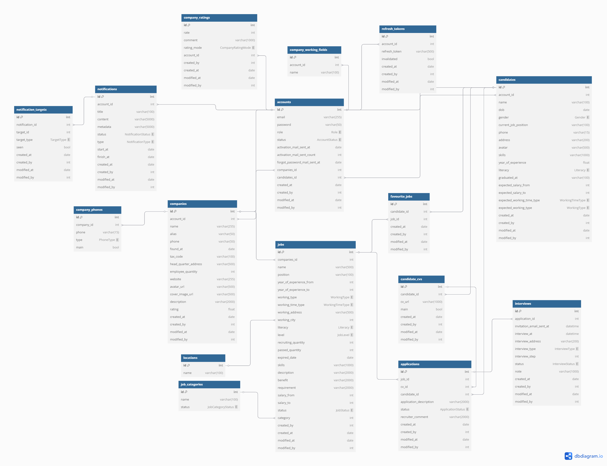

# recruitment-project

## 1. Giới thiệu đề tài
### 1.1 Tổng quan
- Tên đề tài : Website tuyển dụng việc làm Superio
- Lý do chọn đề tài :
  + Theo khảo sát của Digital Viet Nam 2024 . Việt Nam có 
    78,44 triệu người sử dụng Internet , với tỷ lệ tiếp cận 
    79,1% .
  + Việc tuyển dụng nhân sự và tìm kiếm công việc thông qua 
    website việc làm là xu hướng tất yếu của ngành Human 
    Resources .
### 1.2 Các role, chức năng có trong hệ thống
#### 1.2.1 Account 
    + Register
    + Activate email 
    + Login
    + Change Password
    + Change Information
    + Watch Information
    + Logout
    + Forgot Password
#### 1.2.2 Candidate
##### 1.2.2.1 Các chức năng về jobs
- Tìm kiếm và xem danh sách jobs
- Xem chi tiết job
    + Watch Applications
    + Activate favourite jobs
    + Delete favourite jobs
    + Search Jobs
    + Show Job Details
    + Create Cv
    + Watch All Cv
    + Download Cv
    + Delete Cv
    + Set Cv Main
    + Create Application
    + Watch All Companies
    + Watch Company Details
#### 1.2.3 Company
    + Update Job
    + Delete Job
    + Post Job
    + Change Job Status
    + Watch All Job
    + Watch Job Details
    + Download Cv
    + Watch All Applications
    + Watch Application Details
    + Change Application status
    + Create Interview
    + Watch All Interviews
    + Watch Interview Details
    + Change Interview Status
    + Change Interview Note
    + Watch All Candidate
    + Watch Candidate Details
    + Watch All Companies
    + Watch Company Details

## 2. Phân tích thiết kế
### 2.1 Công nghệ sử dụng
  + Javascript
  + Spring Boot
  + Thymeleaf
  + Bootstrap
  + Font Awesome
  + Mysql

### 2.2 Sequence
- Sequence chung cho mọi account

  
- Sequence cho role candidate

- Sequence cho role company

### 2.3 DB

### 2.4 Data mẫu

### 2.5 Cấu trúc project, hướng dẫn chạy project

## 3. Thành quả và hướng phát triển tương lai
